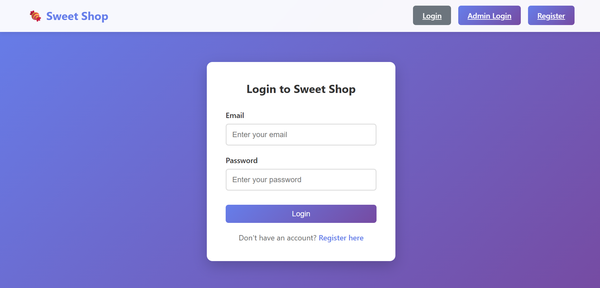
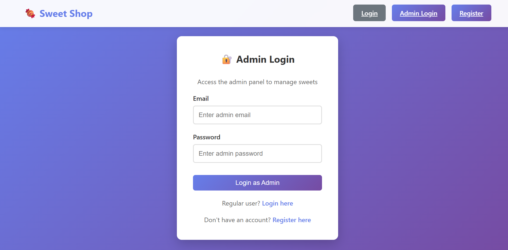
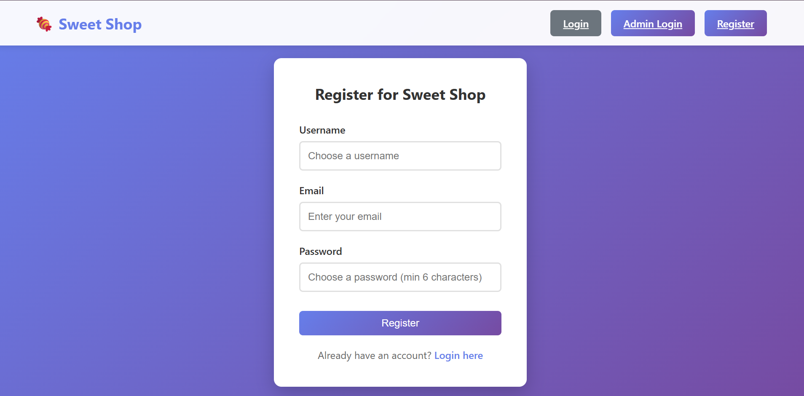
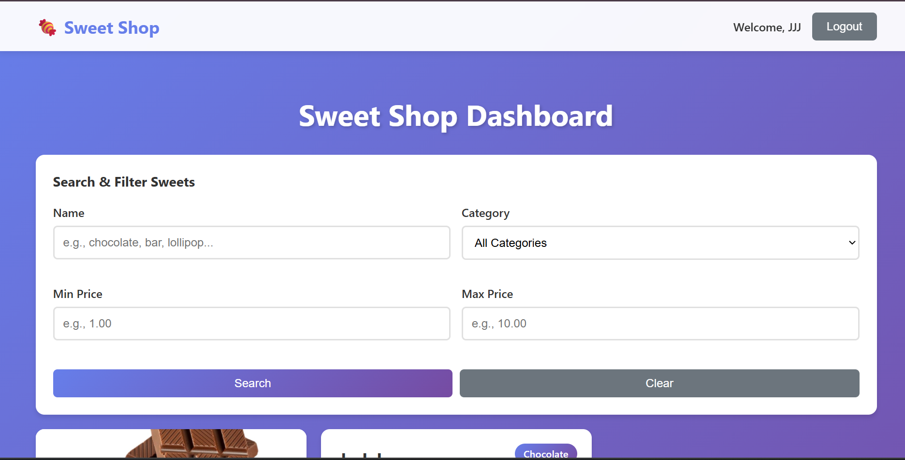
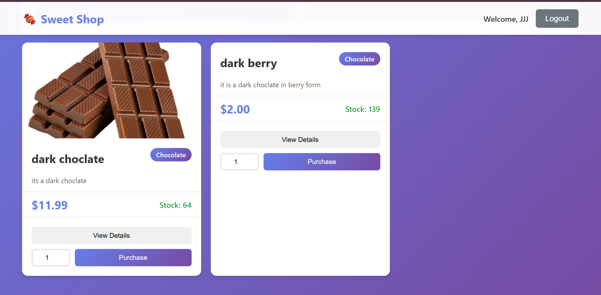
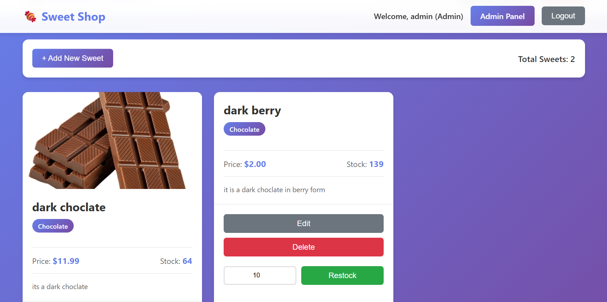
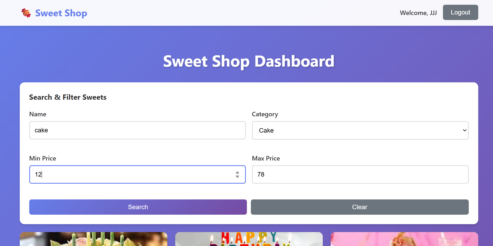
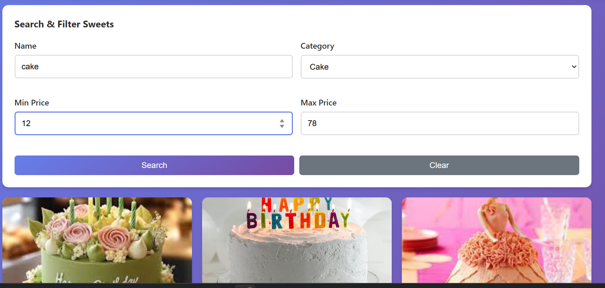
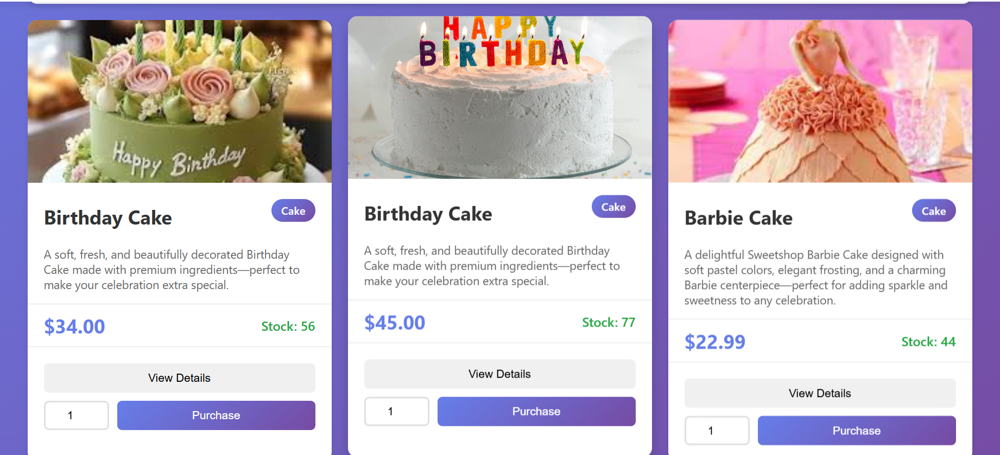

# Sweet Shop Management System
# Author -Sonali Jatav
A full-stack web application for managing a sweet shop inventory, built with Node.js, Express, MongoDB, and React. This project follows Test-Driven Development (TDD) principles and implements a complete RESTful API with user authentication and role-based access control.

## 🎯 Features

### Backend API
- **User Authentication**: JWT-based authentication with registration and login
- **Role-Based Access Control**: Admin and regular user roles
- **Sweet Management**: Full CRUD operations for sweets
- **Inventory Management**: Purchase and restock functionality
- **Search & Filter**: Search sweets by name, category, and price range
- **Comprehensive Testing**: High test coverage with Jest and Supertest

### Frontend Application
- **Modern React SPA**: Built with React 18 and React Router
- **User Authentication**: Login and registration forms
- **Dashboard**: Beautiful, responsive dashboard to view all sweets
- **Search & Filter**: Advanced search functionality
- **Purchase System**: Purchase sweets with quantity selection
- **Admin Panel**: Full admin interface for managing sweets (add, edit, delete, restock)

## 🛠️ Technology Stack

### Backend
- **Node.js** with **Express.js** - RESTful API server
- **MongoDB** with **Mongoose** - Database and ODM
- **JWT (jsonwebtoken)** - Token-based authentication
- **bcryptjs** - Password hashing
- **Jest & Supertest** - Testing framework
- **express-validator** - Input validation

### Frontend
- **React 18** - UI library
- **React Router DOM** - Client-side routing
- **Axios** - HTTP client for API calls
- **CSS3** - Modern, responsive styling

## 📋 Prerequisites

Before you begin, ensure you have the following installed:
- **Node.js** (v14 or higher)
- **npm** (v6 or higher)
- **MongoDB** (v4.4 or higher) - Make sure MongoDB is running on your system

## 🚀 Setup Instructions

### 1. Clone the Repository

```bash
git clone <your-repository-url>
cd Incubyte
```

### 2. Install Dependencies

Install dependencies for both backend and frontend:

```bash
# Install root dependencies (optional)
npm install

# Install backend dependencies
cd backend
npm install

# Install frontend dependencies
cd ../frontend
npm install
```

Or use the convenience script:

```bash
npm run install:all
```

### 3. Configure Environment Variables

#### Backend Configuration

Create a `.env` file in the `backend` directory:

```bash
cd backend
cp .env.example .env
```

Edit `backend/.env` with your configuration:

```env
PORT=5000
MONGODB_URI=mongodb://localhost:27017/sweet-shop
JWT_SECRET=your-super-secret-jwt-key-change-this-in-production
NODE_ENV=development
```

**Important**: 
- Make sure MongoDB is running on your system
- Change `JWT_SECRET` to a strong, random string in production
- Update `MONGODB_URI` if your MongoDB is running on a different host/port

### 4. Start MongoDB

Make sure MongoDB is running on your system:

**Windows:**
```bash
# If MongoDB is installed as a service, it should start automatically
# Otherwise, start it manually:
mongod
```

**macOS/Linux:**
```bash
# Using Homebrew (macOS)
brew services start mongodb-community

# Or manually
mongod
```

### 5. Run the Application

#### Option A: Run Backend and Frontend Separately

**Terminal 1 - Backend:**
```bash
cd backend
npm run dev
```

The backend server will start on `http://localhost:5000`

**Terminal 2 - Frontend:**
```bash
cd frontend
npm start
```

The frontend will start on `http://localhost:3000` and automatically open in your browser.

#### Option B: Use Root Scripts

```bash
# Terminal 1 - Backend
npm run dev:backend

# Terminal 2 - Frontend
npm run dev:frontend
```

### 6. Run Tests

To run the backend test suite:

```bash
cd backend
npm test
```

To run tests with coverage:

```bash
cd backend
npm test -- --coverage
```

## 📚 API Endpoints

### Authentication Endpoints

| Method | Endpoint | Description | Access |
|--------|----------|-------------|--------|
| POST | `/api/auth/register` | Register a new user | Public |
| POST | `/api/auth/login` | Login user | Public |

### Sweet Endpoints

| Method | Endpoint | Description | Access |
|--------|----------|-------------|--------|
| POST | `/api/sweets` | Add a new sweet | Admin |
| GET | `/api/sweets` | Get all sweets | Authenticated |
| GET | `/api/sweets/search` | Search sweets | Authenticated |
| GET | `/api/sweets/:id` | Get sweet by ID | Authenticated |
| PUT | `/api/sweets/:id` | Update a sweet | Admin |
| DELETE | `/api/sweets/:id` | Delete a sweet | Admin |

### Inventory Endpoints

| Method | Endpoint | Description | Access |
|--------|----------|-------------|--------|
| POST | `/api/sweets/:id/purchase` | Purchase a sweet | Authenticated |
| POST | `/api/sweets/:id/restock` | Restock a sweet | Admin |

### Request/Response Examples

#### Register User
```bash
POST /api/auth/register
Content-Type: application/json

{
  "username": "john_doe",
  "email": "john@example.com",
  "password": "password123"
}
```

#### Login
```bash
POST /api/auth/login
Content-Type: application/json

{
  "email": "john@example.com",
  "password": "password123"
}
```

#### Add Sweet (Admin)
```bash
POST /api/sweets
Authorization: Bearer <token>
Content-Type: application/json

{
  "name": "Chocolate Bar",
  "category": "Chocolate",
  "price": 2.50,
  "quantity": 100,
  "description": "Delicious milk chocolate bar"
}
```

#### Search Sweets
```bash
GET /api/sweets/search?name=chocolate&category=Chocolate&minPrice=1&maxPrice=5
Authorization: Bearer <token>
```

## 🧪 Testing

The project follows Test-Driven Development (TDD) principles. All backend functionality is covered by comprehensive tests.

### Running Tests

```bash
cd backend
npm test
```

### Test Coverage

The test suite includes:
- Authentication tests (register, login, validation)
- Sweet CRUD operation tests
- Inventory management tests (purchase, restock)
- Authorization and access control tests
- Error handling tests

View coverage report:
```bash
cd backend
npm test -- --coverage
```

## 👤 User Roles

### Regular User
- View all sweets
- Search and filter sweets
- Purchase sweets
- Cannot add, edit, or delete sweets

### Admin User
- All regular user permissions
- Add new sweets
- Edit existing sweets
- Delete sweets
- Restock inventory

**Note**: To create an admin user, you can either:
1. Manually update the user's role in MongoDB
2. Modify the registration endpoint to allow admin creation (for development only)

## 🎨 Screenshots

### Login Page
)



### Dashboard



### Admin Panel


## Search Products 



*Note: Add your actual screenshots to the `screenshots/` directory*

## 📁 Project Structure

```
Incubyte/
├── backend/
│   ├── models/
│   │   ├── User.js
│   │   └── Sweet.js
│   ├── routes/
│   │   ├── auth.js
│   │   └── sweets.js
│   ├── middleware/
│   │   └── auth.js
│   ├── tests/
│   │   ├── auth.test.js
│   │   └── sweets.test.js
│   ├── server.js
│   ├── package.json
│   ├── jest.config.js
│   └── .env.example
├── frontend/
│   ├── public/
│   │   └── index.html
│   ├── src/
│   │   ├── components/
│   │   │   ├── Navbar.js
│   │   │   ├── PrivateRoute.js
│   │   │   ├── SweetCard.js
│   │   │   ├── SweetForm.js
│   │   │   └── SearchBar.js
│   │   ├── pages/
│   │   │   ├── Login.js
│   │   │   ├── Register.js
│   │   │   └── Dashboard.js
│   │   ├── context/
│   │   │   └── AuthContext.js
│   │   ├── App.js
│   │   ├── index.js
│   │   └── index.css
│   └── package.json
├── .gitignore
├── package.json
└── README.md
```

## 🔒 Security Features

- Password hashing with bcrypt
- JWT token-based authentication
- Protected API routes
- Role-based access control
- Input validation and sanitization
- CORS configuration

## 🚀 Deployment

### Backend Deployment

1. Set environment variables on your hosting platform
2. Ensure MongoDB is accessible (use MongoDB Atlas for cloud deployment)
3. Update CORS settings to allow your frontend domain

### Frontend Deployment

1. Build the React app:
```bash
cd frontend
npm run build
```

2. Deploy the `build` folder to platforms like:
   - Vercel
   - Netlify
   - AWS S3 + CloudFront
   - GitHub Pages

3. Update the API base URL in your frontend code if needed

## 🤖 My AI Usage

### AI Tools Used

During the development of this project, I utilized **AI assistance** (specifically Cursor AI and similar tools) to help with various aspects of the development process.

### How AI Was Used

1. **Code Generation & Boilerplate**
   - Used AI to generate initial project structure and boilerplate code for Express routes, React components, and MongoDB models
   - AI helped create the basic authentication middleware and JWT implementation

2. **Test Writing**
   - Leveraged AI to generate comprehensive test cases for authentication endpoints
   - Used AI assistance to create test suites for sweet CRUD operations and inventory management
   - AI helped structure test cases following TDD principles

3. **Debugging & Problem Solving**
   - Used AI to debug MongoDB connection issues
   - AI assisted in fixing React routing and state management problems
   - Helped resolve CORS and authentication token issues

4. **Code Review & Optimization**
   - AI provided suggestions for code organization and structure
   - Used AI to review and optimize database queries
   - AI helped identify potential security vulnerabilities

5. **Documentation**
   - AI assisted in generating comprehensive README documentation
   - Helped structure API endpoint documentation
   - Generated code comments and explanations

### Reflection on AI Impact

**Positive Impacts:**
- **Faster Development**: AI significantly accelerated the initial setup and boilerplate creation, allowing me to focus on business logic and unique features
- **Learning Tool**: AI suggestions helped me understand best practices and modern patterns in React and Node.js development
- **Error Reduction**: AI caught potential bugs early, especially in async/await patterns and React hooks usage
- **Comprehensive Testing**: AI helped ensure test coverage was thorough, catching edge cases I might have missed

**Challenges & Considerations:**
- **Code Review**: I carefully reviewed all AI-generated code to ensure it met project requirements and followed our coding standards
- **Customization**: AI-generated code often needed customization to fit our specific use cases and business logic
- **Understanding**: I made sure to understand every piece of code, not just copy-paste, to maintain code quality and my own learning

**Responsible Usage:**
- All AI-generated code was reviewed, tested, and customized
- I maintained full understanding of the codebase
- AI was used as a tool to enhance productivity, not replace critical thinking
- All commits where AI was significantly used include co-author attribution

### AI Co-Authorship

For commits where AI assistance was significantly used, I've added co-author attribution following this format:

```
Co-authored-by: AI Assistant <ai@cursor.sh>
```

This ensures transparency about AI usage while maintaining the integrity of the development process.

## 📝 Development Workflow

This project follows TDD (Test-Driven Development) principles:

1. **Red**: Write a failing test
2. **Green**: Write the minimum code to make the test pass
3. **Refactor**: Improve code quality while keeping tests green

## 🤝 Contributing

1. Fork the repository
2. Create a feature branch (`git checkout -b feature/AmazingFeature`)
3. Commit your changes (`git commit -m 'Add some AmazingFeature'`)
4. Push to the branch (`git push origin feature/AmazingFeature`)
5. Open a Pull Request

## 📄 License

This project is licensed under the ISC License.

## 👨‍💻 Author

[Your Name]

## 🙏 Acknowledgments

- Express.js community
- React team
- MongoDB documentation
- All open-source contributors

---

**Note**: This project was developed as part of a TDD Kata exercise. It demonstrates full-stack development skills, testing practices, and modern development workflows including AI-assisted development.

